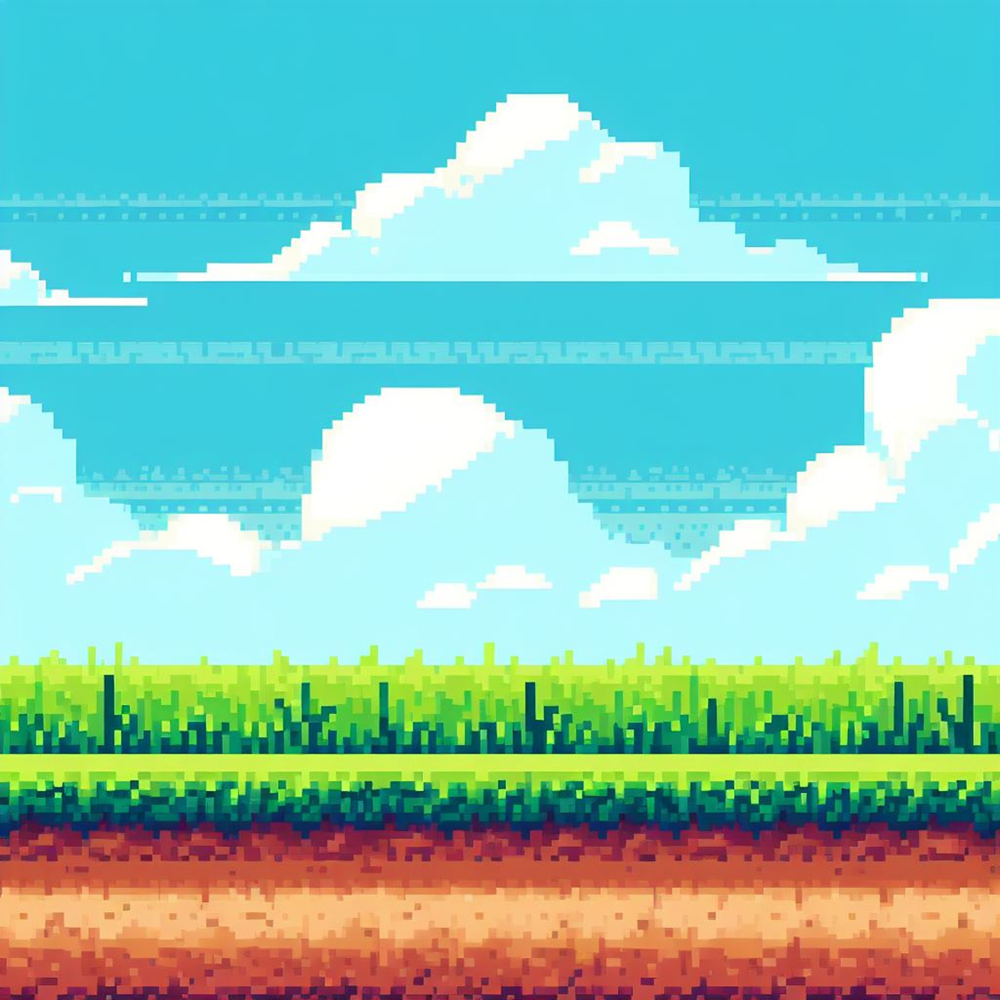

## Site Theme
This file serves as a documentation of the theme / style I am aiming for.

### Pixel art
As I am no artist or have much creativity, the game element will be made in a pixel art style as there exist a plethora of tools to generate and create pixel art assets. Additionally there is a lot of great work I can take inspiration from.

### The assets
The following is a rough idea of how I imagine the assets. It is mostly a collection of images serving as a theme mood board.

#### The character
For the character I want an image of myself in the shape of an ellipsis with detached hands and feet.

The sprite is self-made. The hands and feet need some colors, shading and detail. Also the size relation is subject to change.

#### The environment
The foreground has to be some sort of walking surface and some layer beneath such as dirt.
The background can be a sky with some clouds.
Perhaps in the middleground there can be some grass straws.
Ideally, all the layers will be moving at different speeds to give a depth perception i.e., the further back elements move slower.

This image is generated by DALL-E 3. I like the vibrant colors, so I'll likely go with a similar style, I just need to separate the layers to have them move independently.

#### The milestone entity
When reaching a milestone I want there to be an entity associated with it. An example could be graduating university, it would make sense to have a building.

This image is generated by DALL-E 3.

#### The milestone descriptions
For a milestone I want there to be an object, which when collided with, will trigger to display the relevant description for that particular milestone. I was first considering a scroll unwrapping with the text on. This is quite generic. Another approach, that I like more, is to have an object relevant to the particular milestone be displayed in front of the milestone entity. For the university example this could be a graduation hat.

Image is found on google images. The text could then be displayed in the sky or perhaps on a scroll still that shows up. I was also thinking to have the character collects these objects. This could give a sense of progression, especially if the character wears / holds the items collected. Another example could be a medal for finishing my first marathon. With this approach I would have to somehow make the text stay after the object is collected.

### Asset size relation
These are the relative sizes of assets to ensure pixel size are roughly the same for all items.
The importance is the relation, not the number value (HxW):

- Milestone object: 32x32
- Middleground grass: 32xInf
- Middleground trees: 96x48
- Background clouds: < 64x192
- Milestone entity: < 256x192
- Foreground grass layer: 16xInf
- Foreground dirt layer: 80xInf
- Sprite body: 48x48
- Sprite arms / legs: 16x16